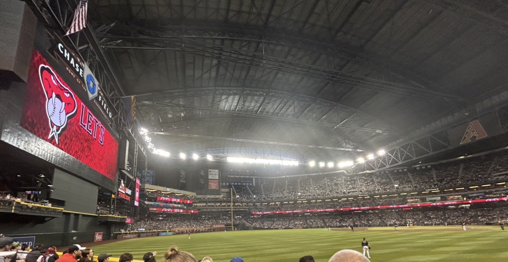

I'm a senior at UT Austin studying Statistics and Data Science, with minors in
Economics and in the Business and Analytics of Sports, and a certificate in
Elements of Computing. I work on analytics for the UT baseball program. I grew
up in Arizona and have been to more than 50 Diamondbacks games. Baseball is what
got me into this field. It was the first sport to take data seriously and it's
still the most analytical one, so the numbers were interesting to me before the
statistics were. Going forward I want to apply my data science skills in
economics and finance.

[My GitHub](https://github.com/cfranco2005)



## Ballparks I've been to

- Chase Field, Phoenix, AZ
- Petco Park, San Diego, CA
- Oracle Park, San Francisco, CA
- Oakland Coliseum, Oakland, CA
- Sutter Health Park, Sacramento, CA
- Globe Life Field, Arlington, TX
- Daikin Park, Houston, TX
- Fenway Park, Boston, MA
- Yankee Stadium, New York, NY
- Citizens Bank Park, Philadelphia, PA

```{r echo=FALSE}
Sys.time()
```